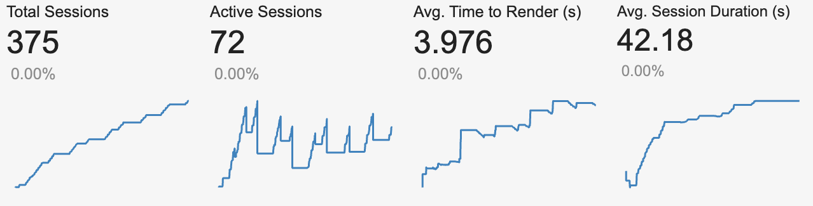
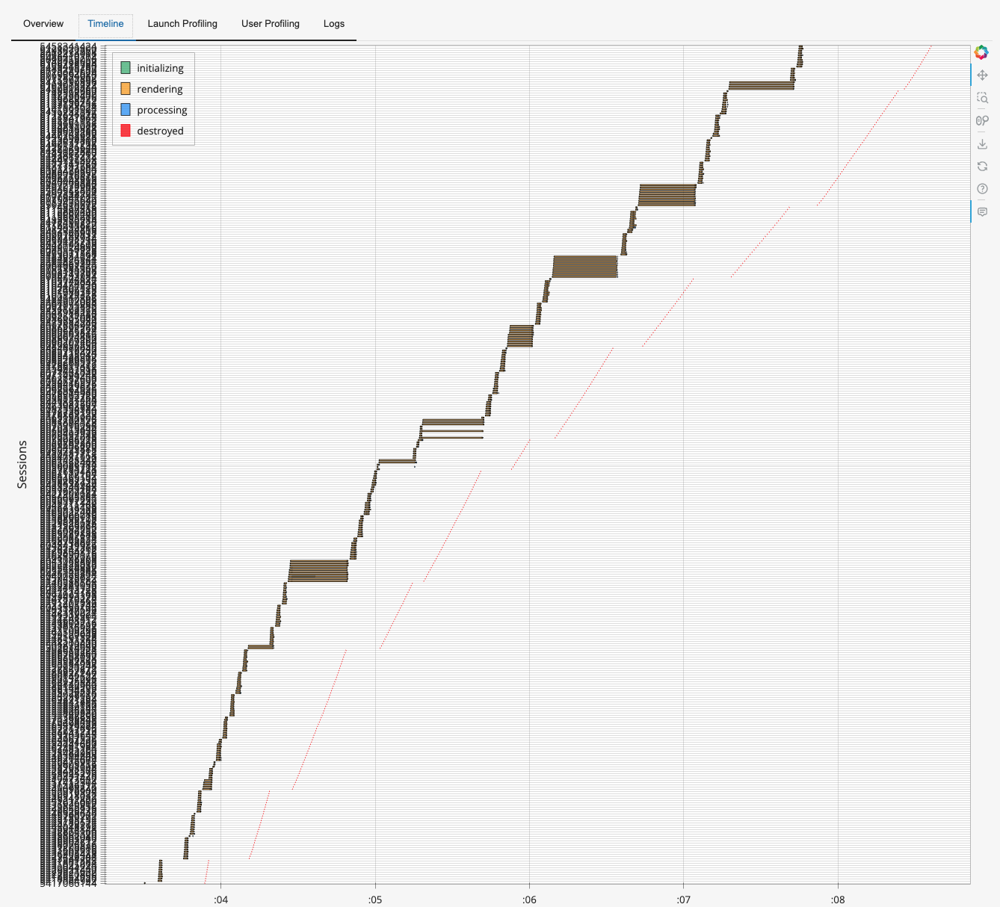
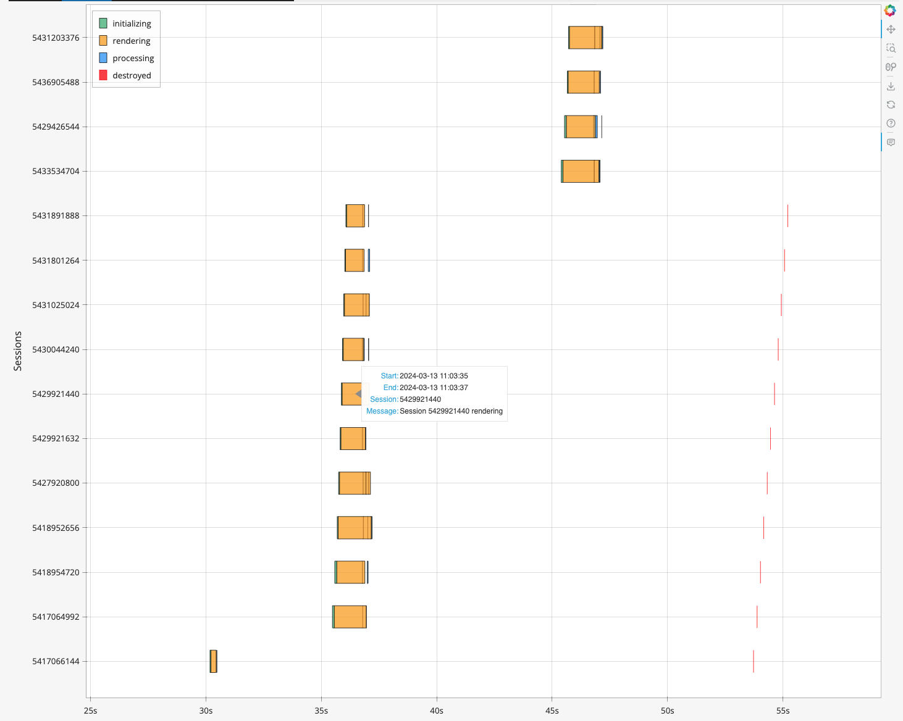
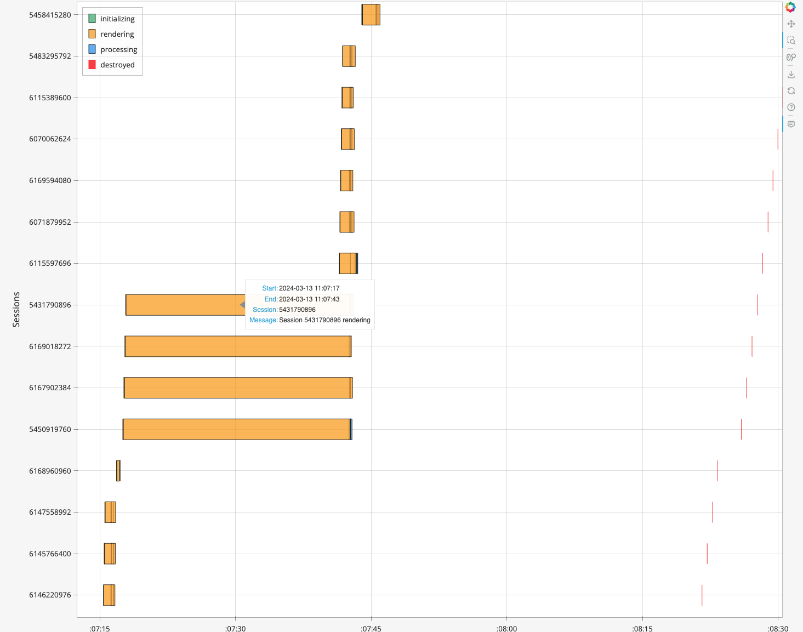
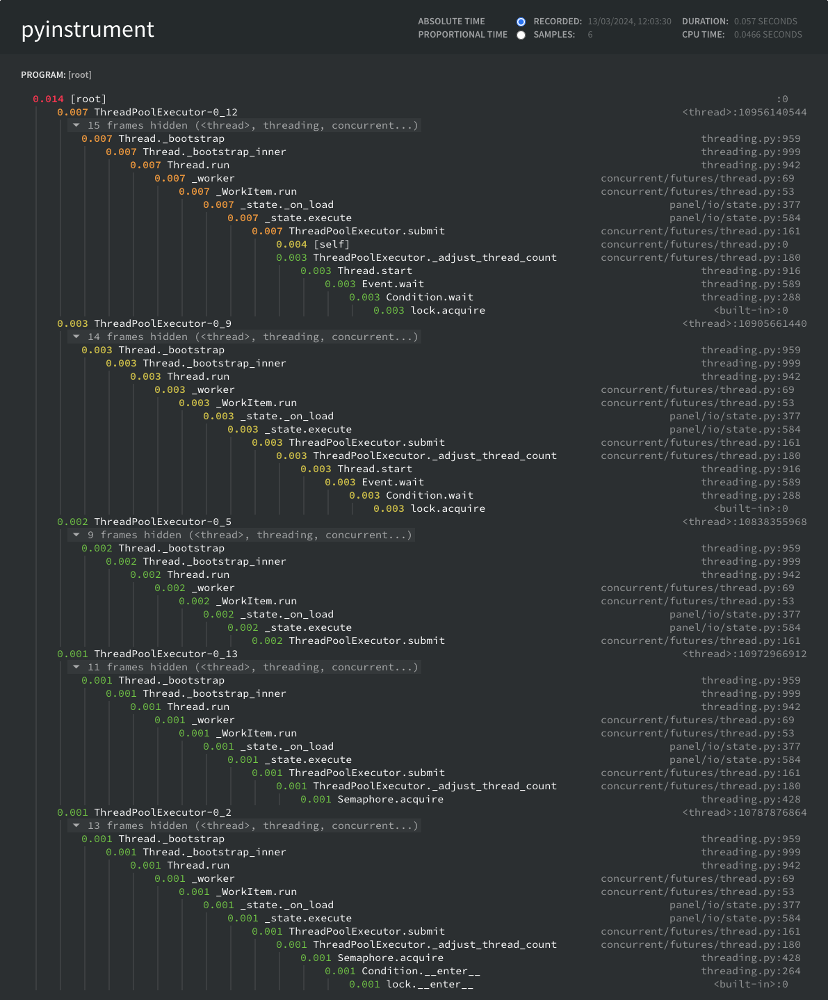

# Panel Performance Test

This repo is created to test the base [Panel](https://panel.holoviz.org/) app performance under load. It uses [k6](https://k6.io/) for load testing.

## Installation

1. Install conda ([docs](https://conda.io/projects/conda/en/latest/user-guide/install/index.html))
2. Create conda environment: `conda env create`
3. Activate environment: `conda activate panel-performance`
4. Install k6 ([docs](https://grafana.com/docs/k6/latest/get-started/installation/))

## Run Test

### Run Panel Application

To run the simple Panel app used for testing run `python app.py`

The app should run on <http://localhost:5555/>

### Run Load test

To run the load test:

1. Start the Panel app server
2. Run `k6 run k6.js`

It's useful to check the panel server admin page at <http://localhost:5555/admin> while running the test to check panel server behavior

## Testing strategy

### Server configurations

We create a very simple Panel page that just displays `Hello, world!` rendered in a template. We enable `defer_load` and `nthreads` options so the panel server can handle multiple requests at the same time. We are still testing a single server so we don't set `num_procs` option.

Since `defer_load` and `global_loading_spinner` options are enabled, panel would show a loader until it loads the page completely.

### Test procedures

We use a browser for the load test, we check 2 things:

1. The server responded to our request
2. All loaders are detached from the page, meaning that all content have been shown

### Test metrics

We care specifically about these metrics:

- `checks{check:server_responded}`: Check if server request was successful. Should have success rate >= 95%
- `checks{check:page_loaded}`: Check if the page fully loaded. Should have success rate >= 95%
- `browser_web_vital_fcp`:  Measures the time it takes for the browser to render the first DOM element on the page. Should be under 1 seconds for 90% of users. Refer to [First Contentful Paint](https://web.dev/fcp/) for more information.
- `browser_web_vital_lcp`: Measures the time it takes for the largest content element on a page to become visible. Should be under 3 seconds for 90% of users. Refer to [Largest Contentful Paint](https://web.dev/lcp/) for more information.

Refer to [k6 metrics documentation](https://grafana.com/docs/k6/latest/using-k6/metrics/reference/) for more information.

### Test scenarios

Currently, there are 3 scenarios defined for k6 tests for panel:

- `single`: Tests that 1 user can access the page successfully.
- `single_load`: Tests that 10 users can simultaneously access the page once successfully.
- `load`: Tests that 10 users can use the app simultaneously and continuously for 4 minutes.

Refer to [k6 scenarios documentation](https://grafana.com/docs/k6/latest/using-k6/scenarios/) for more information.

## Results

These results are gathered with:

- Machine:
  - OS: macOS Ventura 13.3.1
  - CPU: Apple M1 Pro
  - #Cores: 10 (8 performance and 2 efficiency)
  - Memory: 16 GB
- Panel Server:
  - Python: 3.10.13
  - Panel: 1.3.8
  - Bokeh: 3.3.4
  - Param: 2.0.2
  - #Threads: 14
- K6 version: k6 v0.49.0 (go1.21.6, darwin/arm64)

The results may vary depending on the machine and load on the OS, but the outcome should be similar.

### K6 results

Here are the k6 report:

```sh
     ✓ server_responded
     ✓ page_loaded

     browser_data_received...............................: 1.4 GB  5.6 MB/s
     browser_data_sent...................................: 4.2 MB  17 kB/s
     browser_http_req_duration...........................: avg=856.6ms  min=2.67ms   med=212.55ms max=24.44s  p(90)=671.33ms p(95)=891.88ms
     browser_http_req_failed.............................: 0.00%   ✓ 0        ✗ 10561
     browser_web_vital_cls...............................: avg=0        min=0        med=0        max=0       p(90)=0        p(95)=0       
   ✗ browser_web_vital_fcp...............................: avg=3.03s    min=217.7ms  med=1.03s    max=24.69s  p(90)=8.83s    p(95)=24.1s   
     ✗ { scenario:load }.................................: avg=3.1s     min=217.7ms  med=1.03s    max=24.69s  p(90)=8.85s    p(95)=24.2s   
     ✗ { scenario:single_load }..........................: avg=991.97ms min=873.39ms med=980.25ms max=1.16s   p(90)=1.13s    p(95)=1.14s   
     ✓ { scenario:single }...............................: avg=235.8ms  min=235.8ms  med=235.8ms  max=235.8ms p(90)=235.8ms  p(95)=235.8ms 
   ✗ browser_web_vital_lcp...............................: avg=3.13s    min=287.59ms med=1.13s    max=24.73s  p(90)=8.86s    p(95)=24.12s  
     ✗ { scenario:load }.................................: avg=3.19s    min=287.59ms med=1.14s    max=24.73s  p(90)=8.88s    p(95)=24.23s  
     ✓ { scenario:single_load }..........................: avg=1.09s    min=973.69ms med=1.09s    max=1.26s   p(90)=1.2s     p(95)=1.23s   
     ✓ { scenario:single }...............................: avg=330.7ms  min=330.7ms  med=330.7ms  max=330.7ms p(90)=330.7ms  p(95)=330.7ms 
     browser_web_vital_ttfb..............................: avg=1.11s    min=58.7ms   med=321.69ms max=23.81s  p(90)=696.13ms p(95)=7.91s   
   ✓ checks..............................................: 100.00% ✓ 750      ✗ 0    
     ✓ { check:page_loaded }.............................: 100.00% ✓ 375      ✗ 0    
     ✓ { check:server_responded }........................: 100.00% ✓ 375      ✗ 0    
     ✓ { scenario:load,check:page_loaded }...............: 100.00% ✓ 364      ✗ 0    
     ✓ { scenario:load,check:server_responded }..........: 100.00% ✓ 364      ✗ 0    
     ✓ { scenario:load }.................................: 100.00% ✓ 728      ✗ 0    
     ✓ { scenario:single_load,check:page_loaded }........: 100.00% ✓ 10       ✗ 0    
     ✓ { scenario:single_load,check:server_responded }...: 100.00% ✓ 10       ✗ 0    
     ✓ { scenario:single_load }..........................: 100.00% ✓ 20       ✗ 0    
     ✓ { scenario:single,check:page_loaded }.............: 100.00% ✓ 1        ✗ 0    
     ✓ { scenario:single,check:server_responded }........: 100.00% ✓ 1        ✗ 0    
     ✓ { scenario:single }...............................: 100.00% ✓ 2        ✗ 0    
     data_received.......................................: 0 B     0 B/s
     data_sent...........................................: 0 B     0 B/s
     iteration_duration..................................: avg=5.85s    min=498.37ms med=2.31s    max=25.99s  p(90)=23.12s   p(95)=25.32s  
     iterations..........................................: 375     1.460688/s
     vus.................................................: 10      min=0      max=10 
     vus_max.............................................: 10      min=10     max=10 


running (4m16.7s), 00/10 VUs, 375 complete and 0 interrupted iterations
single      ✓ [======================================] 1 VUs   0.9s/3s  1/1 iters, 1 per VU
single_load ✓ [======================================] 10 VUs  2.5s/7s  10/10 iters, 1 per VU
load        ✓ [======================================] 10 VUs  4m0s    
```

Here is a table to summarize the results:

| Scenario | Pages Loaded (%) | FCP 90% (s) | LCP 90% (s) | LCP Relative Degradation |
| ---------- | ------- | ------- | ------- | ------- |
| single | 100% | 0.24s | 0.33s | x1 |
| single_load | 100% | 1.13s | 1.2s | x3.42 |
| load | 100% | 8.85s | 8.88s | x26.9 |

From the results, we notice that:

- No matter how much time the server takes, all requests are fulfilled eventually
- The more users use the app simultaneously, the more the performance degrade
- The longer users actively use the app, the more the performance degrade

### Panel server

#### Server console

While running the test, the sever console show 2 things:

1. WS connection closed warning `WARNING:bokeh.server.views.ws:Failed sending message as connection was closed`.
   This is due to the VU closing the browser once the test ends; Yet, we don't get that error for each session opened.

2. A `ValueError`:

```sh
exception calling callback for <Future at 0x140868520 state=finished raised ValueError>
Traceback (most recent call last):
  File "/opt/homebrew/Caskroom/miniconda/base/envs/panel-performance/lib/python3.10/concurrent/futures/_base.py", line 342, in _invoke_callbacks
    callback(self)
  File "/opt/homebrew/Caskroom/miniconda/base/envs/panel-performance/lib/python3.10/site-packages/panel/io/state.py", line 435, in _handle_future_exception
    self._handle_exception(exception)
  File "/opt/homebrew/Caskroom/miniconda/base/envs/panel-performance/lib/python3.10/site-packages/panel/io/state.py", line 442, in _handle_exception
    raise exception
  File "/opt/homebrew/Caskroom/miniconda/base/envs/panel-performance/lib/python3.10/concurrent/futures/thread.py", line 58, in run
    result = self.fn(*self.args, **self.kwargs)
  File "/opt/homebrew/Caskroom/miniconda/base/envs/panel-performance/lib/python3.10/site-packages/panel/reactive.py", line 447, in _change_event
    self._process_events(events)
  File "/opt/homebrew/Caskroom/miniconda/base/envs/panel-performance/lib/python3.10/site-packages/panel/reactive.py", line 1307, in _process_events
    self._process_data(events.pop('data'))
  File "/opt/homebrew/Caskroom/miniconda/base/envs/panel-performance/lib/python3.10/site-packages/panel/widgets/tables.py", line 1335, in _process_data
    return super()._process_data(data)
  File "/opt/homebrew/Caskroom/miniconda/base/envs/panel-performance/lib/python3.10/site-packages/panel/reactive.py", line 1281, in _process_data
    self._update_column(col, values)
  File "/opt/homebrew/Caskroom/miniconda/base/envs/panel-performance/lib/python3.10/site-packages/panel/widgets/tables.py", line 1594, in _update_column
    self.value.loc[index, column] = array
  File "/opt/homebrew/Caskroom/miniconda/base/envs/panel-performance/lib/python3.10/site-packages/pandas/core/indexing.py", line 911, in __setitem__
    iloc._setitem_with_indexer(indexer, value, self.name)
  File "/opt/homebrew/Caskroom/miniconda/base/envs/panel-performance/lib/python3.10/site-packages/pandas/core/indexing.py", line 1942, in _setitem_with_indexer
    self._setitem_with_indexer_split_path(indexer, value, name)
  File "/opt/homebrew/Caskroom/miniconda/base/envs/panel-performance/lib/python3.10/site-packages/pandas/core/indexing.py", line 1998, in _setitem_with_indexer_split_path
    raise ValueError(
ValueError: Must have equal len keys and value when setting with an iterable
```

The hello world page doesn't use pandas or table widgets, but the admin page was open while running the test and this error might be from the admin page. The error doesn't seem to be fatal as the server didn't crush and pages continue to be served.

#### Admin page overview

for the `single` scenario, We get 1 session with average time to render of 0.3 second. Average session duration is 22.2 seconds.

for the `single_load` scenario, We get 10 sessions with average time to render of 1.1 seconds. Average session duration is 26.7 seconds.

While the `load` scenario is running, the number of sessions ramp up quickly, with max total sessions of 375 and max active sessions of 103. Average time to render shoots up to 3.9 seconds and average session duration to 42 seconds.

We notice that even after the test is finished, the admin page is still calculating sessions for a while as if it was lagging. It takes an additional minute after the test is done to be able to close all active sessions (75 session at the end of the test).



We generally notice that:

- The performance degrade with more requests.
- All sessions are closed eventually.
- Session duration is always greater than 20 seconds regardless of how fast the page is served, and can degrade with more requests.

#### Sessions timeline

We checked the sessions timeline tab to see how individual sessions behaved with time.



Each row corresponds to a single session, with the x-axis corresponding to the time of the action.

We noticed the variation of 2 things with time:

- The time it takes a session to render
- The time it takes a session till it's finally destroyed

At the start of the test, sessions would render in 1-2 seconds. It would take around 25-30 seconds till the session is destroyed. It continues to do the same most of the time.



while the test advanced, we notice periods where sessions are getting slower to render. The first time that happened, 2 sessions took 10 seconds to fully render. This continues to happen with time.

Also, each time such long sessions happen, we notice that it takes more time for following sessions to get destroyed, even if the sessions it self takes 1-2 seconds to render.

At the end of the test, most sessions would still render in 1-2 seconds with the long sessions taking around 35 seconds. It would take around 35-40 seconds till the session is destroyed.



As for concurrency, we notice that:

- Sessions are initialized sequentially.
- Sessions are rendered and processed simultaneously.
- Sessions are destroyed sequentially.

We also notice that each time a session takes long to render, older sessions are destroyed at the same time. That means session destruction can block session rendering.

From that we identify that sessions handling can be considered a bottle neck in Panel. Even with a constant number of users, the longer we soak the server in requests, the more degradation to performance we face.

#### Profiler

We use `pyinstrument` as a profiler to check where does the degradation in performance happen in page:



We notice that the profiler didn't catch any performance metrics for the actual page. It only measured performance of  `on_load` hooks. Multiple threads were used to serve our page, meaning that multiple users could be served in parallel. The overall time calculated is less that 0.1 seconds with is not proportionate to the average session duration, average render time, or any k6 metrics.

So it wasn't very useful to have.

## Conclusion

From the test we conclude the following:

- No matter how much time the server takes, all requests are fulfilled eventually
- The more users use the app simultaneously, the more the performance degrade
- The longer users actively use the app, the more the performance degrade
- Session duration always takes more that the request time, leading to sessions accumulating in server with time.
- Session handling is a bottleneck in Panel.
